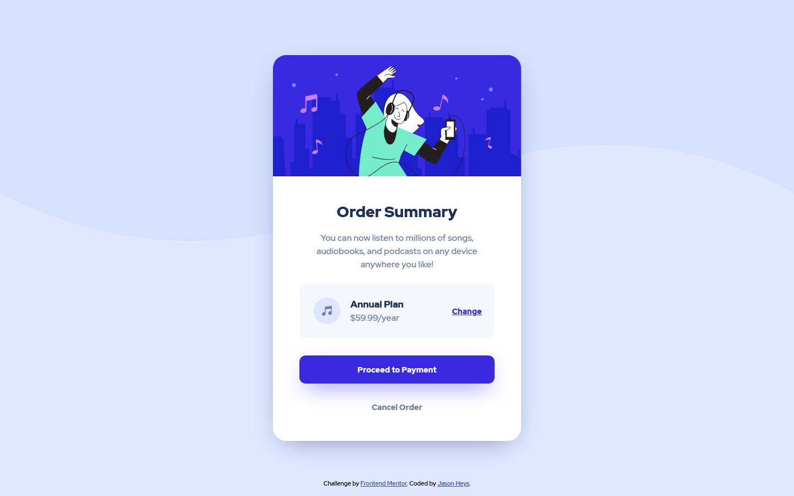

# Frontend Mentor - Order summary card solution

This is a solution to the [Order summary card challenge on Frontend Mentor](https://www.frontendmentor.io/challenges/order-summary-component-QlPmajDUj). Frontend Mentor challenges help you improve your coding skills by building realistic projects.

## Table of contents

- [Overview](#overview)
  - [The challenge](#the-challenge)
  - [Screenshot](#screenshot)
  - [Links](#links)
- [My process](#my-process)
  - [What I learned](#what-i-learned)
  - [Useful resources](#useful-resources)
- [Author](#author)

## Overview

### The challenge

The challenge is to build out this order summary card component and get it looking as close to the provided design as possible.

Users should be able to:

- See hover states for interactive elements

### Screenshot

### Links

- Live Site URL: [https://heyitsgany.github.io/order-summary-card/](https://heyitsgany.github.io/order-summary-card/)

## My process

### What I learned

Working from an external design document and images to produce a finished product which looks and functions as close to the initial design as possible.

Making appropriate decisions in regards to font sizes and weight, element padding, margins. Making sure that the design is responsive and works on a variety
of devices.

### Useful resources

- [Box Shadow Generator](https://html-css-js.com/css/generator/box-shadow/) - This helped me for working on the box shadows. Takes some of the guess work out of the properties.

## Author

- Frontend Mentor - [@heyitsgany](https://www.frontendmentor.io/profile/heyitsgany)
- Twitter - [@heyitsgany](https://www.twitter.com/heyitsgany)
